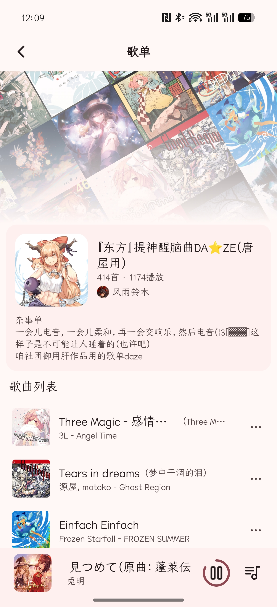
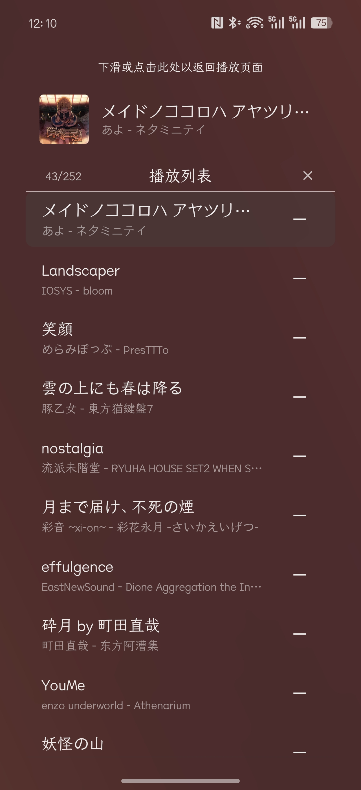

# 有言音乐
一款基于 ```Jetpack Compose``` 和 ```AndroidX Media3```框架的第三方社区轻量网易云音乐Android客户端。

更多功能实现中，目前仅支持基本的登录账号和搜索、播放等能力。

感谢[Moriafly](https://github.com/Moriafly)的[SaltUI](https://github.com/Moriafly/SaltUI)和其作品[Salt Player](https://moriafly.com/program/salt-player.html)提供的灵感💕

| 首页 | 歌单 | 播放器歌词页 | 播放列表 |
|--------|--------|--------|--------|
|  |  |  |  |

## ⚠️注意
本项目依赖于 [ApiEnhanced](https://github.com/NeteaseCloudMusicApiEnhanced/api-enhanced) ，因此在使用前，您先确保您已拥有使用部署了该项目程序的站点的权限以及拥有具备VIP权限的账号，本项目不主动实现也不许诺任何侵犯其版权的特性和功能。

## 感谢以下开源项目的支持
[ApiEnhanced](https://github.com/NeteaseCloudMusicApiEnhanced/api-enhanced)<br/>
[SaltUI](https://github.com/Moriafly/SaltUI)<br/>
[accompanist-lyrics-ui](https://github.com/6xingyv/accompanist-lyrics-ui)<br/>
[InnerTune](https://github.com/z-huang/InnerTune)
